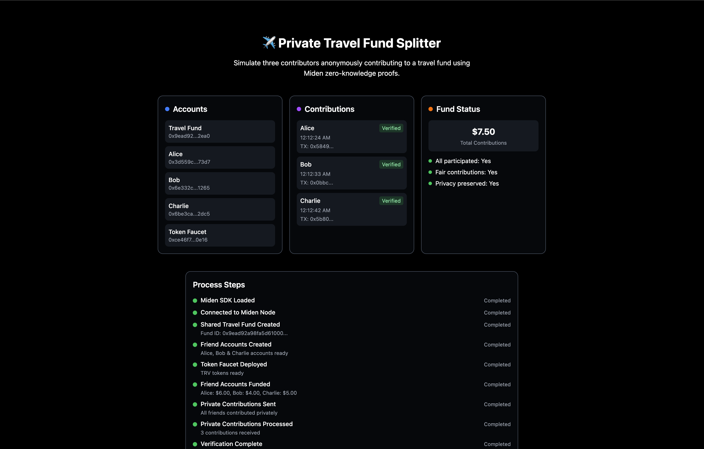

# ZK Private Travel Fund Splitter 
## Project Overview

The Private Travel Fund Splitter is a zero-knowledge dApp that lets a group of friends contribute privately to a shared travel fund—without revealing how much each person paid. Everyone can see the total amount, but individual contributions remain private. This project showcases how the Miden WebClient SDK brings privacy-preserving features to real-world use cases.

It's a great demo of combining transparency and privacy using zero-knowledge proofs and notes, making it perfect for collective payment scenarios like travel, events, or crowdfunding.



> Learn more [here](https://gist.github.com/emmaglorypraise/4d50c88f135acc8dc2a0979f005a9783)
## Getting Started

First, run the development server:

```bash
npm run dev
# or
yarn dev
# or
pnpm dev
# or
bun dev
```

Open [http://localhost:3000](http://localhost:3000) with your browser to see the result.
